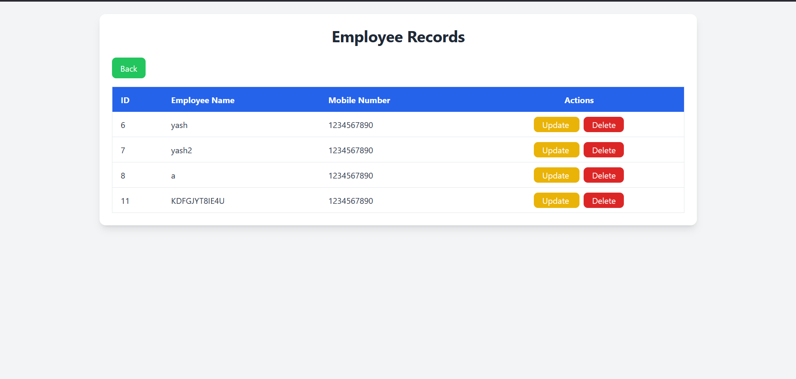
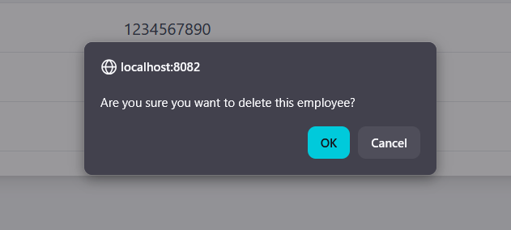
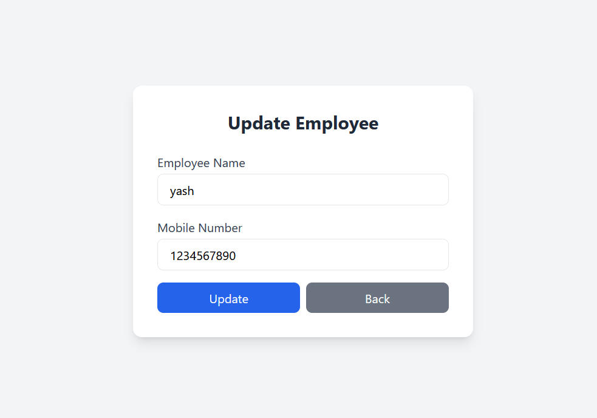

# 📘 Employee Management – Servlet Example - Insert

This Markdown file contains the **Servlet (`insert.java`)** used to receive form data from `index.jsp` and insert it into a MySQL database using **JDBC**.

---

## Database Table

```java
CREATE TABLE empdata (
    id INT AUTO_INCREMENT PRIMARY KEY,
    empname VARCHAR(100),
    mobileno VARCHAR(15)
);
```


## 📄 insert.jsp (HTML)
 STEP 1 IS MAKE FIRST HTML PAGE 

```java
<%@ page language="java" contentType="text/html; charset=UTF-8"
    pageEncoding="UTF-8"%>
<!DOCTYPE html>
<html>
<head>
<meta charset="UTF-8">
<title>Employee Form</title>

<!-- Tailwind CSS CDN -->
<script src="https://cdn.tailwindcss.com"></script>

</head>
<body class="bg-gray-100 min-h-screen flex items-center justify-center">

    <div class="bg-white p-8 rounded-xl shadow-lg w-full max-w-md">
        <h2 class="text-2xl font-bold text-center text-gray-800 mb-6">
            Employee Details
        </h2>

        <form action="insert" method="get" class="space-y-4">

            <!-- Employee Name -->
            <div>
                <label class="block text-gray-700 font-medium mb-1">
                    Employee Name
                </label>
                <input
                    type="text"
                    name="empname"
                    placeholder="Enter employee name"
                    required
                    class="w-full px-4 py-2 border rounded-lg focus:outline-none focus:ring-2 focus:ring-blue-500"
                />
            </div>

            <!-- Mobile Number -->
            <div>
                <label class="block text-gray-700 font-medium mb-1">
                    Mobile Number
                </label>
                <input
                    type="tel"
                    name="mobileno"
                    placeholder="Enter mobile number"
                    pattern="[0-9]{10}"
                    required
                    class="w-full px-4 py-2 border rounded-lg focus:outline-none focus:ring-2 focus:ring-blue-500"
                />
            </div>

            <!-- Submit Button -->
            <div>
                <button
                    type="submit"
                    class="w-full bg-blue-600 text-white py-2 rounded-lg hover:bg-blue-700 transition duration-200"
                >
                    Submit
                </button>
            </div>
            
            <!-- Show Users Button -->
			<div class="mb-4 text-center">
			    <button
			        type="button"
			        onclick="window.location.href='home.jsp';"
			        class="bg-green-500 text-white py-2 px-4 rounded-lg hover:bg-green-600 transition duration-200"
			    >
			        Show Users
			    </button>
			</div>
            

        </form>
    </div>

</body>
</html>
```

## 📄 insert.java (Sevlet)
Now make backed code
```java
package Insert;

import jakarta.servlet.ServletException;
import jakarta.servlet.annotation.WebServlet;
import jakarta.servlet.http.HttpServlet;
import jakarta.servlet.http.HttpServletRequest;
import jakarta.servlet.http.HttpServletResponse;
import java.io.IOException;
import java.io.PrintWriter;
import java.sql.Connection;
import java.sql.DriverManager;
import java.sql.PreparedStatement;


/**
 * Servlet implementation class insert
 */
@WebServlet("/insert")
public class insert extends HttpServlet {
	private static final long serialVersionUID = 1L;
       
    /**
     * @see HttpServlet#HttpServlet()
     */
    public insert() {
        super();
        // TODO Auto-generated constructor stub
    }

	/**
	 * @see HttpServlet#doGet(HttpServletRequest request, HttpServletResponse response)
	 */
	protected void doGet(HttpServletRequest request, HttpServletResponse response) throws ServletException, IOException {
		// TODO Auto-generated method stub
//		response.getWriter().append("Served at: ").append(request.getContextPath());
		 	response.setContentType("text/html");
		 
		 	PrintWriter pw = response.getWriter();
			String empname  = request.getParameter("empname");
			String empmobile = request.getParameter("mobileno");

			try {
				
				Class.forName("com.mysql.cj.jdbc.Driver");
				
				// Connection 
				
				Connection conn = DriverManager.getConnection(
					    "jdbc:mysql://localhost:3306/employee",
					    "root",
					    ""
					);
				
				//Create SQL Statement
				PreparedStatement ps = conn.prepareStatement(
					    "insert into empdata (empname , mobileno) values (? , ?)"
					);
				
				// For Data Set
				ps.setString(1,empname);
				ps.setString(2, empmobile);
				
				
				// Execute Query
				int count = ps.executeUpdate();
				
				if(count == 1) {
					pw.println("<p>Insert Data Successfully</p>");
					
					response.sendRedirect("home.jsp");
				}else
				{
					pw.println("<p>Insert Data Unsuccessfully</p>");
				}
				
			}catch(Exception e) {
				pw.println(e);
			}
		 }

	/**
	 * @see HttpServlet#doPost(HttpServletRequest request, HttpServletResponse response)
	 */
	protected void doPost(HttpServletRequest request, HttpServletResponse response) throws ServletException, IOException {
		// TODO Auto-generated method stub
		doGet(request, response);
	}

}
```

## 📄 home.jsp (HTML)
NOW MAKE HOME.JSP BECAUSE SHOW ALL DATA

```java
<%@ page language="java" contentType="text/html; charset=UTF-8"
    pageEncoding="UTF-8"%>

<%@ page import="java.sql.*" %>

<!DOCTYPE html>
<html>
<head>
<meta charset="UTF-8">
<title>Employee List</title>

<!-- Tailwind CSS CDN -->
<script src="https://cdn.tailwindcss.com"></script>

</head>
<body class="bg-gray-100 min-h-screen p-6">

    <div class="max-w-6xl mx-auto bg-white shadow-lg rounded-xl p-6">
        
        <h1 class="text-3xl font-bold text-center text-gray-800 mb-6">
            Employee Records
        </h1>

	<div class="mb-4">
       <button onclick="window.location.href='index.jsp';" 
        class="bg-green-500 text-white px-4 py-2 rounded-lg hover:bg-gray-600 transition">
		    Back
		</button>

    </div>
        <!-- Table -->
        <div class="overflow-x-auto">
            <table class="min-w-full border border-gray-200 rounded-lg">
                <thead class="bg-blue-600 text-white">
                    <tr>
                        <th class="py-3 px-4 text-left">ID</th>
                        <th class="py-3 px-4 text-left">Employee Name</th>
                        <th class="py-3 px-4 text-left">Mobile Number</th>
                        <th class="py-3 px-4 text-center">Actions</th>
                    </tr>
                </thead>
                <tbody class="text-gray-700">

                    <%
                        try {
                            Class.forName("com.mysql.cj.jdbc.Driver");

                            Connection conn = DriverManager.getConnection(
                                "jdbc:mysql://localhost:3306/employee",
                                "root",
                                ""
                            );

                            PreparedStatement ps = conn.prepareStatement(
                                "SELECT * FROM empdata"
                            );

                            ResultSet rs = ps.executeQuery();

                            while(rs.next()) {
                    %>

                    <tr class="border-b hover:bg-gray-100">
                        <td class="py-3 px-4"><%= rs.getInt("id") %></td>
                        <td class="py-3 px-4"><%= rs.getString("empname") %></td>
                        <td class="py-3 px-4"><%= rs.getString("mobileno") %></td>
                        <td class="py-3 px-4 text-center space-x-2">

                            <!-- Update Button -->
                            <a href="update.jsp?id=<%= rs.getInt("id") %>" class="bg-yellow-500 text-white px-4 py-1 rounded-lg hover:bg-yellow-600 transition">
                                Update
                            </a>

                            <!-- Delete Button -->
                            <a href="delete.jsp?id=<%= rs.getInt("id") %> "
                             onclick="return confirm('Are you sure you want to delete this employee?');"
                               class="bg-red-600 text-white px-4 py-1 rounded-lg hover:bg-red-700 transition">
                                Delete
                            </a>

                        </td>
                    </tr>

                    <%
                            }
                            rs.close();
                            ps.close();
                            conn.close();
                        } catch(Exception e) {
                    %>
                        <tr>
                            <td colspan="4" class="text-center py-4 text-red-600">
                                <%= e.getMessage() %>
                            </td>
                        </tr>
                    <%
                        }
                    %>

                </tbody>
            </table>
        </div>

        

    </div>

</body>
</html>
```


## 📄 delete.jsp (HTML)
NOW MAKE DELETE JSP WHEN USER CLICK DELETE BUTTON THAN USEER DELETE IN DATABASE
```java
<%@ page language="java" contentType="text/html; charset=UTF-8"
    pageEncoding="UTF-8"%>
 
<!-- import java sqlile   --> 
<%@ page import="java.sql.*" %>
<!DOCTYPE html>
<html>
<head>
<meta charset="UTF-8">
<title>Insert title here</title>
</head>
<body>
	<%
		// get id 
		String id = request.getParameter("id");
		
		// check karva nu id null chhe k nai
		if(id != null){
			try{
				
				Class.forName("com.mysql.cj.jdbc.Driver");
				
				// Connection 
				
				Connection conn = DriverManager.getConnection(
					    "jdbc:mysql://localhost:3306/employee",
					    "root",
					    ""
					);
				
				//Create SQL Statement
				PreparedStatement ps = conn.prepareStatement(
					    "delete from empdata where id = ?"
					);
				
				ps.setInt(1, Integer.parseInt(id));
				ps.executeUpdate();
				
				ps.close();
				conn.close();
				
				//
				response.sendRedirect("home.jsp");
				
			}catch(Exception e){
				out.println("Error: " + e.getMessage());
			}
		}else{
			response.sendRedirect("home.jsp");
		}
	
	%>
</body>
</html>
```



## 📄 update.jsp (HTML)
NOW MAKE UPDATE JSP USER CLICK UPDATE THAN OPEN THIS PAGE
```java
<%@ page language="java" contentType="text/html; charset=UTF-8"
    pageEncoding="UTF-8"%>
    
    
    
<%@ page import="java.sql.*" %>

<%
		// get id 
		String id = request.getParameter("id");
		String empname = "";
		String mobileno = "";
		// check karva nu id null chhe k nai
		if(id != null){
			try{
				
				Class.forName("com.mysql.cj.jdbc.Driver");
				
				// Connection 
				
				Connection conn = DriverManager.getConnection(
					    "jdbc:mysql://localhost:3306/employee",
					    "root",
					    ""
					);
				
				//Create SQL Statement
			PreparedStatement ps = conn.prepareStatement(
				    "SELECT * FROM empdata WHERE id = ?"
				);

				ps.setInt(1, Integer.parseInt(id));
				ResultSet rs = ps.executeQuery();
				
				 if (rs.next()) {
	                empname = rs.getString("empname");
	                mobileno = rs.getString("mobileno");
	            } else {
	                response.sendRedirect("home.jsp"); // ID not found
	            }
				rs.close();
				ps.close();
				conn.close();
				
			}catch(Exception e){
				out.println("Error: " + e.getMessage());
			}
		}else{
			response.sendRedirect("home.jsp");
		}
	
	%>
	
<!DOCTYPE html>
<html>
<head>
<meta charset="UTF-8">
<title>Update Employee</title>
<script src="https://cdn.tailwindcss.com"></script>
</head>
<body class="bg-gray-100 min-h-screen flex items-center justify-center">

<div class="bg-white p-8 rounded-xl shadow-lg w-full max-w-md">
    <h2 class="text-2xl font-bold text-center text-gray-800 mb-6">
        Update Employee
    </h2>

    <form action="update_action.jsp" method="get" class="space-y-4">
        <input type="hidden" name="id" value="<%= id %>" />

        <!-- Employee Name -->
        <div>
            <label class="block text-gray-700 font-medium mb-1">Employee Name</label>
            <input
                type="text"
                name="empname"
                value="<%= empname %>"
                required
                class="w-full px-4 py-2 border rounded-lg focus:outline-none focus:ring-2 focus:ring-blue-500"
            />
        </div>

        <!-- Mobile Number -->
        <div>
            <label class="block text-gray-700 font-medium mb-1">Mobile Number</label>
            <input
                type="tel"
                name="mobileno"
                value="<%= mobileno %>"
                pattern="[0-9]{10}"
                required
                class="w-full px-4 py-2 border rounded-lg focus:outline-none focus:ring-2 focus:ring-blue-500"
            />
        </div>

        <!-- Buttons -->
        <div class="flex space-x-2">
            <button
                type="submit"
                class="w-full bg-blue-600 text-white py-2 rounded-lg hover:bg-blue-700 transition duration-200"
            >
                Update
            </button>

            <button
                type="button"
                onclick="window.location.href='employees.jsp';"
                class="w-full bg-gray-500 text-white py-2 rounded-lg hover:bg-gray-600 transition duration-200"
            >
                Back
            </button>
        </div>
    </form>
</div>

</body>
</html>
```


## 📄 update_action.jsp (HTML)
THIS FILE HELP TO UPDATE DATA 
```java
<%@ page import="java.sql.*" %>
<%
    String id = request.getParameter("id");
    String empname = request.getParameter("empname");
    String mobileno = request.getParameter("mobileno");

    if (id != null && empname != null && mobileno != null) {
        try {
            Class.forName("com.mysql.cj.jdbc.Driver");
            Connection conn = DriverManager.getConnection(
                "jdbc:mysql://localhost:3306/employee",
                "root",
                ""
            );

            PreparedStatement ps = conn.prepareStatement(
                "UPDATE empdata SET empname=?, mobileno=? WHERE id=?"
            );
            ps.setString(1, empname);
            ps.setString(2, mobileno);
            ps.setInt(3, Integer.parseInt(id));

            ps.executeUpdate();
            ps.close();
            conn.close();

            response.sendRedirect("home.jsp"); // back to employee list
        } catch (Exception e) {
            out.println("Error: " + e.getMessage());
        }
    } else {
        response.sendRedirect("home.jsp");
    }
%>
```